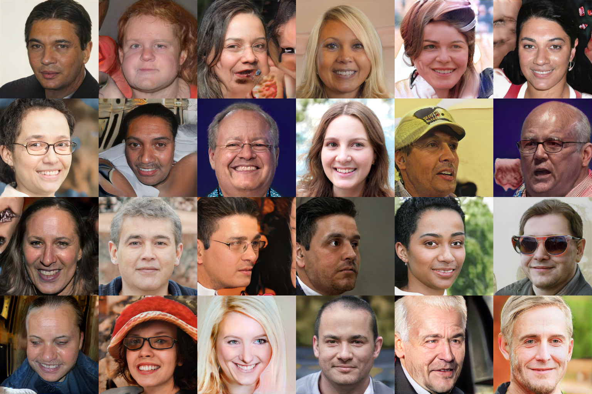
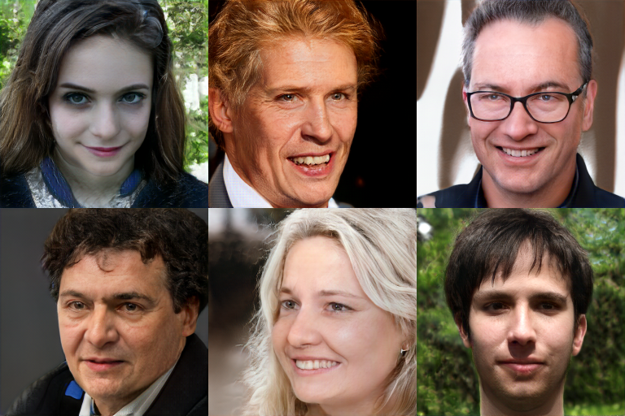
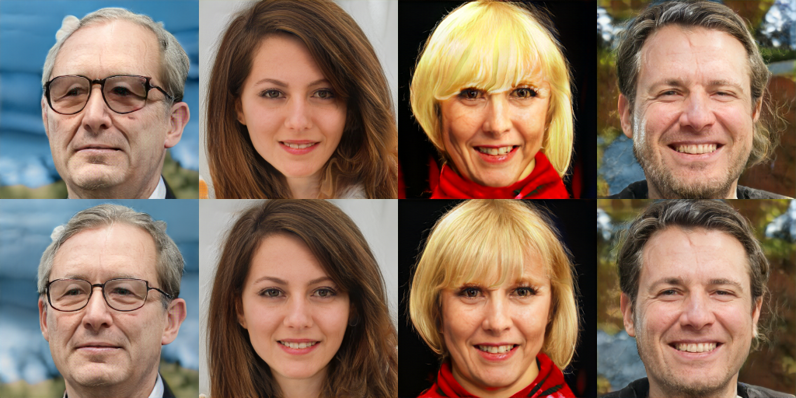

WaveStyleGAN

## Architecture

Overall design (FFHQ config as a reference):
- Generator with skip connections
- Discriminator with skip connections
- Wavelets in generator and discriminator (trainable, adjusted scales and learning rate)
- Reduced complexity of a Mapping network (3 FC layers, smaller dimension of a latent input)
- SiLU activation in generator (Synthesis and Mapping networks)
- Usage of an updated Fast Fourier Convolution blocks (FFCv2) with wavelets for Discriminator
- Differential data augmentations (DIffAug)
- ...

Generator architecture:

Discriminator architecture:

Updated FFCv2 block:

## Generated samples

A model trained on FFHQ dataset for 9.99M images (`configs/FFHQ_v1_best.yaml`). Full resolution samples can be found in `generated_sample` directory 
(samples here are downsampled to speed-up page loading)

Random samples:

Best samples:

Some curated samples with truncation (level=0.75):

